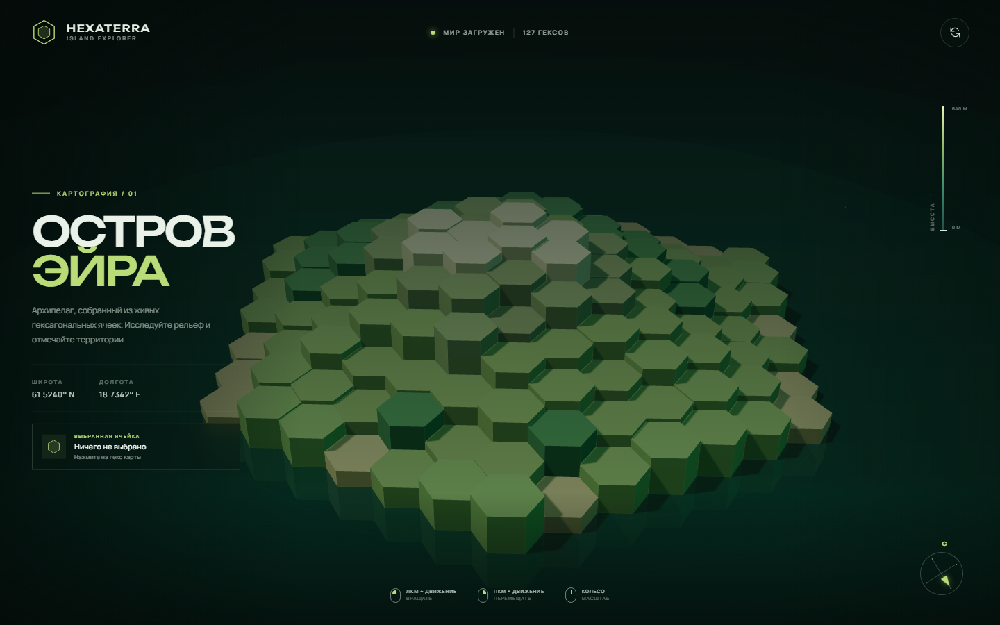

# Hexagonal World

An interactive application for exploring arbitrary hierarchical information in 3D as a hexagonal spatial structure. Data entities are represented by cells, while their hierarchy, grouping, and relationships are expressed through the cells' position, height, color, and surrounding context.

The current version is a visual prototype built around a procedurally generated island. It establishes the navigation, selection, and rendering foundation for connecting real hierarchical datasets later.



## Features

- Spatial representation of entities as hexagonal cells
- Interactive tile selection and hover states
- Orbit, pan, and zoom camera controls
- Responsive information panel for the selected entity
- Real-time lighting, shadows, fog, water, and ambient effects

## Project Direction

The application is intended to support datasets such as organizational structures, knowledge maps, project breakdowns, taxonomies, and other nested information. The visualization should remain independent of a specific domain: a data adapter maps source entities and their parent-child relationships into the common hexagonal scene model.

## Requirements

- Node.js 20.19+ or 22.12+
- npm

## Getting Started

```bash
npm install
npm run dev
```

Open the local URL printed by Vite.

## Commands

| Command | Description |
| --- | --- |
| `npm run dev` | Start the development server |
| `npm run build` | Create a production build in `dist/` |
| `npm run preview` | Preview the production build locally |

## Controls

- Left mouse button: rotate the camera
- Right mouse button: pan the camera
- Mouse wheel: zoom
- Click a hex: select a terrain tile
- Reset button: restore the default camera view

## Project Structure

```text
.
|-- index.html
|-- src/
|   |-- main.js
|   `-- style.css
|-- hexagonal-world.png
`-- package.json
```

## Technology

- [Three.js](https://threejs.org/)
- [Vite](https://vite.dev/)

## Force-Directed Layout Architecture

### Overview
This feature introduces a selectable `force-anchors` mode using `d3-force` running in a dedicated module worker. The layout is calculated off the main thread to ensure continuous responsiveness.

### Architecture Boundaries & File Roles
- `src/hex.js`: Centralizes axial helpers, rounding, distance, spiral coordinate systems, and pointy-top axial-to-plane projections.
- `src/data.js`: Validates input hierarchies and transforms them into domain-neutral entities.
- `src/layout.js`: Handles legacy layouts, mode metadata, and common result statistics.
- `src/force-layout.js`: Sets up the Mulberry32 random generator, linear alpha decay schedules, virtual anchors, immediate-parent links, and custom hex-assignment force for stable placement.
- `src/layout-worker.js`: Module-worker entry point managing calculate requests and structured-cloneable error/success transport.
- `src/layout-runner.js`: Manages async worker promise resolution, terminators, silent cancellations, and the 60,000ms production safety hang-guard.
- `src/island.js`: Three.js rendering manager. Sets tower transparency to 50% in force mode, batches debug spring lines at `y = 0`, disables depth-writes for transparent items, and handles idempotent disposal of GPU assets.
- `src/main.js`: Main coordinator orchestrating user inputs, selection status announcements, calculating state alerts, and transactional commits of candidate islands.

### Controls & Accessibility
- Native select elements are keyboard and touch accessible.
- Calculator busy states set `aria-busy="true"` on the form.
- The UI remains readable and reachable at mobile viewports down to 360px CSS width and short screen heights.

### Testing and Validation
Run unit tests, browser tests, and benchmarks using the following scripts:
- `npm test`: Node.js unit tests for pure layout, worker serialization, and geometry helpers.
- `npm run test:e2e`: E2E validation of app interaction, error handling, visual contrast, camera presets, and responsive behavior.
- `npm run benchmark:layout`: Performance benchmarks evaluating warmups, completion latency, Tab response times, and post-commit frame rates.
