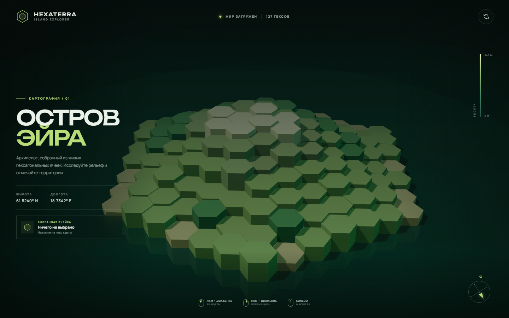

# Hexagonal World

An interactive application for exploring arbitrary hierarchical information in 3D as a hexagonal spatial structure. Data entities are represented by cells, while their hierarchy, grouping, and relationships are expressed through the cells' position, height, color, and surrounding context.

The current version is a visual prototype built around a procedurally generated island. It establishes the navigation, selection, and rendering foundation for connecting real hierarchical datasets later.



## Features

- Spatial representation of entities as hexagonal cells
- Interactive tile selection and hover states
- Orbit, pan, and zoom camera controls
- Responsive information panel for the selected entity
- Real-time lighting, shadows, fog, water, and ambient effects
- Realtime force evolution with visible step-0, assignments, anchors, and relationship springs
- Deterministic exact-center terminal frames and retained worker sessions for future controls

## Project Direction

The application is intended to support datasets such as organizational structures, knowledge maps, project breakdowns, taxonomies, and other nested information. The visualization should remain independent of a specific domain: a data adapter maps source entities and their parent-child relationships into the common hexagonal scene model.

## Requirements

- Node.js 20.19+ or 22.12+
- npm

## Getting Started

```bash
npm install
npm run dev
```

Open the local URL printed by Vite.

## Commands

| Command | Description |
| --- | --- |
| `npm run dev` | Start the development server |
| `npm run build` | Create a production build in `dist/` |
| `npm run preview` | Preview the production build locally |
| `npm run test:e2e` | Run desktop, local phone-emulation, and tablet-emulation Chromium journeys |
| `npm run benchmark:layout` | Run the local desktop/phone/tablet benchmark projects |

## Controls

- Left mouse button: rotate the camera
- Right mouse button: pan the camera
- Mouse wheel: zoom
- Click a hex: select a terrain tile
- Reset button: restore the default camera view

## Project Structure

```text
.
|-- index.html
|-- src/
|   |-- main.js
|   `-- style.css
|-- hexagonal-world.png
`-- package.json
```

## Technology

- [Three.js](https://threejs.org/)
- [Vite](https://vite.dev/)

## Force-Directed Layout Architecture

### Overview
This feature introduces a selectable `force-anchors` mode using `d3-force` running in a dedicated module worker. The layout is calculated off the main thread to ensure continuous responsiveness.

### Architecture Boundaries & File Roles
- `src/hex.js`: Centralizes axial helpers, rounding, distance, spiral coordinate systems, and both pointy-top plane transforms.
- `src/data.js`: Validates input hierarchies and transforms them into domain-neutral entities.
- `src/layout.js`: Handles legacy layouts, mode metadata, and common result statistics.
- `src/force-layout.js`: Owns the deterministic version-2 session, evolving unique assignments, in-tick center locks, exact terminal serialization, and the request-scoped fix/release seam.
- `src/layout-worker.js`: Module-worker state machine that gates every normal-motion step on the exact returned paint buffer and retains successful sessions inertly.
- `src/layout-runner.js`: Validates topology, frame order, terminal equality, callbacks, commit handshakes, control sequencing, and request lifecycle ownership.
- `src/island.js`: Owns detached live/stable force islands with one reusable tower mesh and spring buffer; terminal transforms consume direct Float32 frame coordinates.
- `src/main.js`: Coordinates RAF paint receipts, non-live progress, reduced-motion final-only presentation, rollback-safe commits, and existing camera/selection semantics.

### Controls & Accessibility
- Native select elements are keyboard and touch accessible.
- Calculator busy states set `aria-busy="true"` on the form.
- Force progress is visible but `aria-live="off"`; only calculation start and terminal status are announced.
- Moving lines are explicitly described as force relationships influencing layout, and terminal status names the final step.
- The UI remains readable and reachable at mobile viewports down to 360px CSS width and short screen heights.

The retained session is intentionally not connected to pointer, touch, keyboard, selection, camera, or accessibility gestures. Click still selects a tower and existing OrbitControls gestures still control the camera.

### Testing and Validation
Run unit tests, browser tests, and benchmarks using the following scripts:
- `npm test`: Node.js unit tests for pure layout, version-2 sessions, command epochs, worker serialization, and geometry helpers.
- `npm run test:e2e`: E2E validation of every-step presentation, error handling, reduced motion, camera/selection semantics, and responsive local Chromium profiles.
- `npm run benchmark:layout`: Performance benchmarks across 1024x720 desktop, 360x800 phone touch emulation, and 768x1024 tablet touch emulation.

Phone and tablet evidence is local Chromium viewport/touch emulation only. It is not native Android, native browser, hardware, or assistive-technology evidence.
